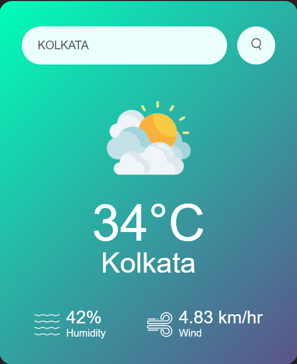

# 🌦️ Weather Forecast App

A simple and clean weather forecast app that shows real-time weather data for any city using the OpenWeatherMap API.

## 🔧 Features

- 🌍 Search for weather by city name
- 🌡️ Displays temperature, humidity, and weather conditions
- 🌀 Uses live weather data from OpenWeatherMap API
- 💻 Responsive design for all devices

## 🚀 Demo

 [](https://weather-forcast-citywise.netlify.app)
 
## 🛠️ Tech Stack

- HTML
- CSS
- JavaScript
- OpenWeatherMap API

## 📦 How to Run Locally

```bash
git clone https://github.com/DonePrakash/weather-forcast.git
cd weather-forcast
# Just open index.html in your browser
